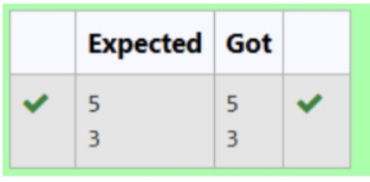

# 🐍 Python OOP: Encapsulation with Private Members

## 🎯 AIM

To implement **Encapsulation** in Python by defining a class `Rectangle` with **private member variables** `__length` and `__breadth`.

---

## 🧠 ALGORITHM

1. **Define the Class**:
   - Create a class `Rectangle` with two private attributes: `__length` and `__breadth`.

2. **Initialize Variables**:
   - Use the `__init__()` constructor to set initial values for `__length` and `__breadth`.

3. **Print Values**:
   - Display the private variables from within the class to demonstrate access.

4. **Instantiate the Object**:
   - Create an object of the `Rectangle` class to trigger the constructor.

---

## 💻 Program
```
class Rectangle:
    __length = 0 
    __breadth = 0
    def _init_(self):
      self.__length = 5
      self.__breadth = 3
      print(self.__length)
      print(self.__breadth)
   
  obj = Rectangle()
```

## Output


## Result
Implement **Encapsulation** in Python by defining a class `Rectangle` with **private member variables** `__length` and `__breadth` was completed successfully and output was generated.